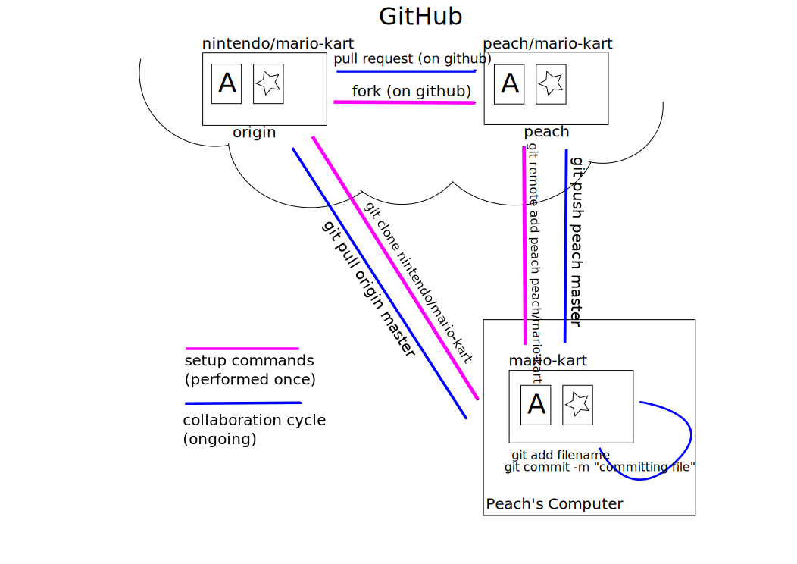

Title: Care and keeping of pull requests
Date: 2015-06-28 21:00
Category: computing
Tags: git, github, collaboration, version control, pull requests, care and keeping of prs
Slug: pull-requests-disclaimer
Authors: Christina Koch

## What is this?

[This is a series of posts on managing pull requests](http://christinalk.github.io/blog/tag/care-and-keeping-of-prs).  It 
is [not an introduction to git](https://try.github.io/levels/1/challenges/1), 
or a rundown of GitHub's features.  It is purely 
a walkthrough of common (I hope!) pull request scenarios, aimed at someone 
who might know [most of the necessary commands already](#prior), but not
 the correct sequence in which to use them.  

I've wanted to do this for a long time - not because the world NEEDS any 
more git/GitHub tutorials, but just because I wanted to get all the ideas 
straight in my head and lay them out in a way that makes sense to me.  If 
just one or two people read + find this useful, it will have more than 
succeeeded.  

## Prior knowledge

These posts assume that the reader already knows: 

- how to commit changes in git
- how to commit changes after a conflict has been created
- what a branch is (mostly)
- the basic ideas of pushing/pulling
- how to setup the "collaborative triangle" (as seen below) 
via forking, cloning + remote add-ing.  

## Remote naming

When working with remote + local repositories, the convention (as far as I 
have seen/understand) is for `origin` to represent the remote that belongs to 
you (your fork of the main repository) and `upstream` to represent the remote 
that is the authoritative main repository (see this in the [original version](https://github.com/ChristinaLK/githubIsFun/blob/master/collaboration-diagram.svg) of the above figure).  I have **not** used this convention 
in what follows; rather, I have used `origin` always for the authoritative 
central repository and usernames for other named remotes.  This is partially 
because I use this naming scheme myself; it also seems more clear to me for 
instructional purposes.  

## Comments

I haven't figured out how to get commenting on this blog, so feedback is welcome 
as an issue or PR on the
 [blog's Github repository](https://github.com/ChristinaLK/blog).  ;)  
 
## Thanks

Huge hat tip to @ahmadia and @wking who held my hand through a lot of my 
initial adventures in learning about the remote aspects of git.  And thanks 
to @gvwilson and the @swcarpentry community in general, for creating the 
space and impetus to learn these skills.  